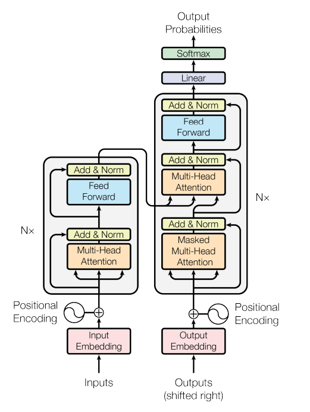
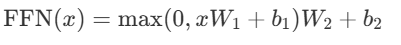
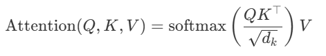
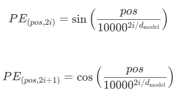

# Attention Is All You Need

This is a summary and partial reproduction of the 2017 paper *Attention Is All You Need*,  
which introduced the Transformer , a model that relies solely on attention mechanisms, removing the need for recurrence or convolutions in sequence modeling.

---

## Motivation: Why Transformers?

Traditional sequence models relied on **Recurrence** (RNNs, LSTMs, GRUs) or **Convolutions** (CNNs), but both have limitations.

### Limitations of Recurrence

- **Lack of Parallelization:**  
  RNNs process tokens sequentially, each hidden state depends on the previous one.  
  This prevents full parallelization during training and slows it down significantly.

- **Vanishing/Exploding Gradients:**  
  Information must propagate through many time steps, which can cause gradients to vanish or explode.  
  LSTMs and GRUs mitigate this but do not fully solve it.

---

### Limitations of Convolutions

- **Small Receptive Field:**  
  A convolutional layer only captures local context.  
  To model long-range dependencies, multiple layers must be stacked, increasing computation.

- **Positional Invariance:**  
  CNNs are designed to detect *what* patterns exist, not *where* they occur.  
  In sequences, position matters, so explicit **positional encoding** is needed.

---

## Transformer Architecture Overview

*Figure from Vaswani et al., 2017 , "Attention Is All You Need"*

> "The encoder maps an input sequence of symbol representations $(x_1, ..., x_n)$  
> to a sequence of continuous representations $z = (z_1, ..., z_n)$.  
> Given $z$, the decoder generates an output sequence $(y_1, ..., y_m)$ one element at a time."

The model consists of **stacked encoders** and **stacked decoders**, each made up of sublayers with residual connections and layer normalization.

---

## Encoder

The **encoder** processes the **source sequence** into contextual representations.

Each encoder block has **two sublayers**:

### 1. Multi-Head Self-Attention

- **Q**: queries from the same source sequence  
- **K**: keys from the same source sequence  
- **V**: values from the same source sequence  

Every token attends to all other tokens in the source, allowing direct modeling of dependencies regardless of distance.

### 2. Position-Wise Feed-Forward Network

- Two fully connected layers applied independently to each position:

- Same parameters are shared across all positions.

---

## Decoder

The **decoder** generates the **target sequence** step-by-step, attending to both previous outputs and the encoder’s representations.

Each decoder block has **three sublayers**:

### 1. Masked Multi-Head Self-Attention

- **Q**: queries from the target sequence so far  
- **K**: keys from the target sequence so far  
- **V**: values from the target sequence so far  
- A mask prevents each position from attending to future tokens.

### 2. Multi-Head Cross-Attention

- **Q**: queries from the decoder’s previous sublayer  
- **K**: keys from the encoder output  
- **V**: values from the encoder output  

This lets the decoder attend to the entire encoded source sequence.

### 3. Position-Wise Feed-Forward Network

Same as in the encoder, applied independently at each position.

---

## Multi-Head Attention

The core operation of the Transformer is **scaled dot-product attention**:

- **Q (Queries)**, **K (Keys)**, **V (Values)** are all vectors derived from the input sequences via learned projection matrices.
- The scaling factor \( \sqrt{d_k} \) prevents large dot products from pushing the softmax into regions with very small gradients.
- **Q (Query):** What the current position is *asking for*.  
- **K (Key):** What each position *offers* as information.  
- **V (Value):** The actual information content to be retrieved.  

**Why multi-head?**  

- Each head can focus on different types of relationships (short-term, long-term, syntactic, semantic). works similar to having multiple attentions

---

## Positional Encoding

Since the Transformer does not use recurrence or convolution, it has no inherent notion of token order.  
To inject sequence order information, **positional encodings** are added to the input embeddings at the bottom of the encoder and decoder stacks.

### Sinusoidal Form

For a position \( pos \) and dimension \( i \):

- Even dimensions use sine, odd dimensions use cosine.
- This allows the model to easily learn relative positions, since \(\sin\) and \(\cos\) are periodic functions.

The positional encoding matrix is **added** to the token embeddings before feeding into the first encoder/decoder layer.

---
